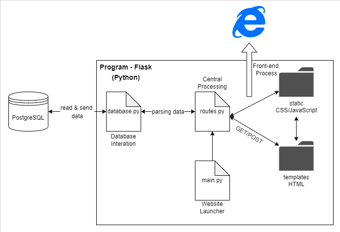
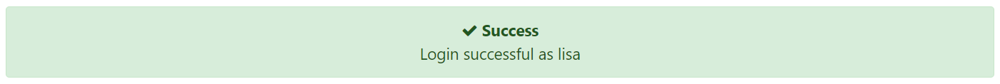
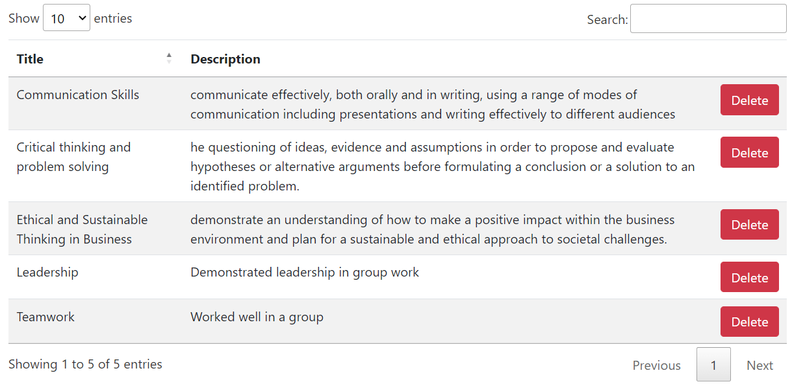
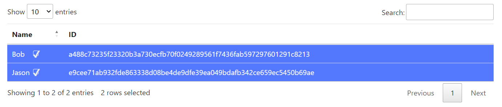

# How to Run
To run this system, you'll need to install [python3](https://www.python.org/downloads/), and some dependencies with pip (the python package manager).
You will also need to be running a [postgresql](https://www.postgresql.org/) database, and update the [config.ini](/config.ini) file to match your database credentials.

1. Download and install python3.
2. Install the following python dependencies with pip:
	- `flask_session`
	- `flask`
	- `psycopg2-binary`
	- `py-bcrypt`
	- `pillow`
	- `qrcode`
    - `waitress`
	- You can run `pip3 install flask_session flask psycopg2-binary py-bcrypt pillow qrcode waitress`
3. Start your postgresql database and ensure the [schema.sql](/schema.sql) file is imported. If you are using [docker](https://docs.docker.com/get-docker/) you can simply run `docker compose up -d` to start a database.
4. Start the flask webserver by running `python3 main.py`
5. You can access the website on [localhost:5000](http://localhost:5000)



# Flash Notification System
Flash notification system provides better user operation feedback function. 
The notification bar will stay for 6s on the webpage.

To activate the notification bar
- For error messages (notification bar will be red)


```python
session['error'] = True
flash('# error-messages')
```

- For success messages (notification bar will be green)


```python
session['error'] = False
flash('# success-messages')
```

# Table listing System
To provide better visualization, [datatable](https://datatables.net/) is used for listing contents.
Users are able to searching, sorting, and making selection.

Programmer are able to self-define table behaviours, such as disable sorting for certain column, multi-selection.

